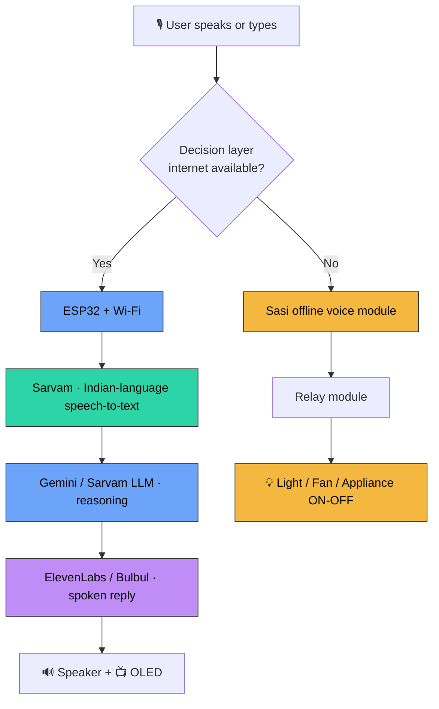

<div align="center">

# 🎤 TecnoVoice

### TECNO: AI-Powered Hybrid Online–Offline Edge–Cloud IoT Voice Assistant


*Intelligence when connected. Reliability when it matters.*

[]()
[]()
[]()
[]()

🌐 **[tecnovoice.me](https://tecnovoice.me)**

> *"Most assistants go silent the moment your Wi-Fi drops. TecnoVoice doesn't."*

</div>

---

## 👋 Start here

If you just want to **see it working**, open [`tecno-voice-assistant-demo.html`](./tecno-voice-assistant-demo.html) in Chrome. No install, no setup. Type or say a command — in Hindi, Telugu, Tamil, or English — and watch it answer and switch a virtual light on and off. Want real AI answers? Paste a Gemini key into the box at the bottom of the page and you're live in under a minute. Full steps are in [Getting Started](#-getting-started).

---

## 📌 Table of Contents

1. [The story behind it](#-the-story-behind-it)
2. [The problem](#-the-problem)
3. [Our solution](#-our-solution)
4. [System architecture](#-system-architecture)
5. [How it actually works](#-how-it-actually-works)
6. [The web demo](#-the-web-demo)
7. [The AI stack (and why each piece)](#-the-ai-stack-and-why-each-piece)
8. [Hardware](#-hardware)
9. [Tech stack](#-tech-stack)
10. [Repository structure](#-repository-structure)
11. [Getting started](#-getting-started)
12. [Usage](#-usage)
13. [Multi-language support](#-multi-language-support)
14. [Security & privacy](#-security--privacy)
15. [Market opportunity](#-market-opportunity)
16. [Cost analysis](#-cost-analysis)
17. [Results](#-results)
18. [Roadmap](#-roadmap)
19. [Vision & growth](#-vision--growth)
20. [The team](#-the-team)
21. [Acknowledgements](#-acknowledgements)
22. [License](#-license)

---

## 💭 The story behind it

We're a group of Cybersecurity students, and this project started with a simple, slightly annoying observation: every "smart" assistant we owned became a useless brick the moment the Wi-Fi blinked. Ask it to turn off a light during a network drop, and it just sits there.

That bothered us for two reasons. First, the practical one — in a lot of India, internet is not a guarantee. It's patchy, it's slow, it disappears. A device that *needs* the cloud to switch on a fan isn't really reliable. Second, the one closer to our field — every word you say to a cloud assistant leaves your house. For people who study data privacy for a living, that's a hard thing to ignore.

So we asked ourselves: **what if one device could be smart when the internet is there, and still completely functional when it isn't?** That question became TecnoVoice.

---

## ❗ The problem

Mainstream assistants like Alexa, Google Home and Siri are impressive, but they all lean on the same foundations:

- An **internet connection**
- **Cloud processing**
- **Subscription ecosystems**
- **Continuous data collection**

That creates real problems, especially in India:

- **700M+ people** face unreliable internet.
- **Rural regions** lack stable connectivity.
- Smart devices **stop working during outages** — even for basic on/off control.
- **Privacy concerns** keep rising as more of daily life is sent to the cloud.

There's a clear gap here: a **low-cost, reliable, privacy-respecting** assistant that doesn't fall apart without a connection.

---

## 💡 Our solution

TecnoVoice is a **dual-mode (hybrid) voice assistant**. It runs two brains side by side and automatically uses whichever fits the moment:

| Mode | What it does | Needs internet? |
|------|--------------|:---------------:|
| 🌐 **Online AI mode** | AI conversations, real-time answers, internet information, smart responses | Yes |
| 🎙️ **Offline smart-control mode** | Local voice commands, appliance control, instant response | **No** |

The result: ask it *"who landed on the moon first?"* and it reasons through the cloud. Lose your connection, say *"लाइट बंद करो"*, and the light still goes off — instantly, locally, no excuses.

---

## 🏗️ System architecture



The key idea is the **decision layer**: it routes each request down the path that will actually succeed right now, so the device never goes fully dark.

---

## ⚙️ How it actually works

### 🌐 Online flow (the intelligent brain)
`Voice input → Microphone → ESP32 → Wi-Fi → Cloud AI → Speaker response`

1. You speak into the microphone (or type in the web demo).
2. The ESP32 captures the audio and sends it over Wi-Fi to our backend.
3. **Sarvam** converts your speech to text — including mixed Hindi-English and other Indian languages.
4. **Gemini** (English/general) or **Sarvam's India-first model** (Indian languages) works out the answer.
5. **ElevenLabs / Sarvam Bulbul** turns that answer back into a natural voice.
6. The reply comes out of the speaker, with status shown on the OLED.

### 🎙️ Offline flow (the reliable brain)
`Voice command → Sasi module → Relay module → Appliance control`

1. The Sasi module listens for known commands locally.
2. When it matches one (e.g. *"turn on light"*), it fires a GPIO pin.
3. That pin trips a **relay**, which switches the 220V appliance.
4. The action happens instantly — no internet touched at any point.

---

## 🖥️ The web demo

We built a complete browser-based simulation so anyone can experience TecnoVoice without owning the hardware. It's a single file — [`tecno-voice-assistant-demo.html`](./tecno-voice-assistant-demo.html) — and it runs anywhere.

**What you can do in it:**
- Talk or type to the assistant and watch the full pipeline light up stage by stage (capture → speech-to-text → reasoning → voice).
- Switch between **English, हिन्दी, తెలుగు and தமிழ்**.
- Give a light command in any of those languages and watch the on-screen **bulb turn on and off** — exactly mirroring what the relay does in hardware.
- Flip between a calm "Bharat voice" and an "expressive" voice persona.

**Two ways to run it:**
- **Offline demo** — open it and go. It responds with built-in sample answers, perfect for a quick walkthrough with no setup.
- **Live AI** — paste your **Gemini API key** into the box at the bottom, and answers start coming from the real model, straight from your browser. No server required.

---

## 🧠 The AI stack (and why each piece)

We didn't pick these just to collect logos — each one has a distinct job:

- **🟢 Sarvam AI — India first.** This is the heart of the language experience. It handles speech-to-text and reasoning for Indian languages, including code-mixed speech like *"light band karo please."* This is what lets a grandparent talk to the device in their own language.
- **🔵 Google Gemini — reasoning.** For general knowledge and English queries, Gemini does the heavy thinking. It's also our quickest path to a live demo (it can be called directly from the browser).
- **🟣 ElevenLabs — expressive voice.** For natural, expressive spoken replies, giving the assistant a real personality instead of a robotic tone.

> Indian-language requests are routed to **Sarvam**; English/general requests go to **Gemini**. Two genuinely different roles, not the same job twice.

---

## 🔩 Hardware

| Component | Purpose |
|-----------|---------|
| **ESP32 Dev Board** | Main controller with built-in Wi-Fi |
| **INMP441** I2S mic | Voice input |
| **MAX98357A** amplifier | Audio output |
| **Speaker** | Voice feedback |
| **0.96" OLED display** | Status display |
| **Sasi module** | Offline, internet-free command recognition |
| **Relay module** | Switches real 220V appliances |
| **Battery module (TP4056 + Li-ion)** | Portable power |

---

## 🧰 Tech stack

- **Firmware:** Embedded C/C++ on Arduino IDE (ESP32 core)
- **Backend:** Node.js (Express) — orchestrates the AI calls and keeps API keys off the client
- **AI / APIs:** Sarvam AI, Google Gemini, ElevenLabs
- **Frontend / demo:** Vanilla HTML, CSS and JavaScript (single file, zero build step)
- **Hardware comms:** I2S audio, GPIO, relay switching

---

## 📁 Repository structure

```
TecnoVoice/
├── tecno-voice-assistant-demo.html   # The browser demo (open this first)
├── tecno-backend/
│   ├── server.js                     # Node backend → Sarvam + Gemini
│   ├── package.json
│   └── README.md                     # Backend setup steps
├── firmware/                         # ESP32 + Sasi module code
└── README.md                         # You are here
```

---

## 🚀 Getting started

### Option A — just see it work (1 minute, no setup)
1. Download/clone this repo.
2. Open **`tecno-voice-assistant-demo.html`** in Chrome.
3. Type a command or tap an example. Done.

### Option B — live AI in the browser (2 minutes)
1. Get a free **Gemini API key** at [aistudio.google.com](https://aistudio.google.com).
2. Open the demo and paste the key into the **"Gemini key"** box at the bottom.
3. The tag flips to **live** — answers now come from the real model.

> ⚠️ The browser key is fine for a demo, but don't commit this file with your key inside it to a public repo.

### Option C — the full backend (Sarvam + Gemini + voice)
```bash
cd tecno-backend
npm install
# open server.js and paste your SARVAM_API_KEY and GEMINI_API_KEY near the top
npm start
```
Then open the demo and put `http://localhost:8787` in the **Backend URL** box. Now Indian-language queries go to Sarvam, English to Gemini, and replies are spoken by Sarvam Bulbul. (Full steps: [`tecno-backend/README.md`](./tecno-backend/README.md).)

### Option D — the hardware
1. Install Arduino IDE and add the ESP32 board.
2. Flash the firmware from `firmware/`.
3. Wire the mic, amp, OLED and Sasi module per the circuit diagram.
4. Connect the relay to your appliance, power up, and start talking.

---

## 🎮 Usage

Try things like:

```
"Who is Elon Musk?"          → intelligent answer (online)
"आज मौसम कैसा है?"            → answered in Hindi
"Turn on the light"          → switches the appliance / on-screen bulb
"लाइट बंद करो"               → turns it off (works offline too)
"విళక్కై ఆన్ చెయ్యి"          → understood in Telugu
```

---

## 🌍 Multi-language support

Offline light control is recognised across **10+ Indian languages and romanised spellings** — Hindi, Telugu, Tamil, Kannada, Marathi, Bengali, Gujarati, Malayalam, Punjabi and English, plus everyday mixes like *"batti jala do"* or *"light band karo."* In online mode, the AI understands essentially any phrasing because it reads meaning, not just keywords.

---

## 🔐 Security & privacy

This is the part we care about most, as Cybersecurity students:

- **Offline by design.** Device control runs entirely on local hardware. Your "turn off the light" never leaves the room.
- **No always-on cloud mic.** The assistant only sends data when you actively ask it something in online mode.
- **Keys stay server-side.** In the full setup, API keys live on your backend, never in the user's browser or firmware.
- **Resilient.** No cloud dependency for core functions means no single point of failure to attack or take offline.

---

## 📈 Market opportunity

Smart assistants are everywhere in metros, but the picture changes fast as you move outward — and that gap is exactly where TecnoVoice fits.

| Segment | Smart-speaker adoption | Notes |
|---------|:---------------------:|-------|
| Urban smart-home households | ~45% | Alexa dominates metros like Bengaluru, Delhi, Mumbai |
| Overall urban internet households | ~10–12% | Out of ~230M urban internet users |
| Rural households | < 5% | Held back by cost and weak regional-language support |
| National average | ~8–10% | Across India's ~958M active internet users |

> Rural India makes up roughly **57%** of internet users but owns far fewer smart devices. A low-cost, offline-capable, multi-language assistant speaks directly to **700M+** underserved users.

---

## 💰 Cost analysis

| Part | Approx. cost |
|------|-------------:|
| ESP32 system | ₹1,050 |
| Offline voice system | ₹700 |
| Assembly & enclosure | ₹300 |
| **Total** | **₹1,800 – ₹2,200** |

That's roughly **half** the price of a typical commercial assistant (~₹4,000+) — and ours keeps working without internet.

---

## 📊 Results

- Accurate, natural AI responses in online mode.
- Reliable, instant appliance control in offline mode.
- Seamless switching between the two depending on connectivity.
- Low-latency operation on low-cost hardware.
- Multi-language commands working in the live demo.

---

## 🔮 Roadmap

| Phase | Focus |
|:-----:|-------|
| **1** | Current hybrid assistant ✅ |
| **2** | Mobile application |
| **3** | Regional languages — Hindi, Gujarati, Telugu, Tamil |
| **4** | Cybersecurity integration (intrusion detection, RF/Bluetooth scanning) |
| **5** | Fully offline AI assistant |

---

## 🌱 Vision & growth

We see TecnoVoice growing in clear, fundable stages:

1. **First 100 customers** — proof of concept, feedback loop, testimonials.
2. **Scale to 1,000** — target gated communities, universities and tech hubs. *(~₹1.6M revenue, ~₹750K gross margin)*
3. **Expand to 10,000** — add regional-language support, bundle with smart bulbs/plugs. *(~₹16M revenue, ~₹7.5M gross margin)*
4. **National rollout** — partner with e-commerce platforms and retail chains.

Target market spans **smart homes, healthcare, education and rural communities** — a potential user base of **700 million+**.

---

## 👨‍💻 The team

**Team TecnoVoice** — B.Sc. IT (Cybersecurity), Ganpat University, Ahmedabad

- Akshat Bhavsar
- Heer Patel
- Peshwa Patel
- Darshan Patel

---

## 🙏 Acknowledgements

Thanks to the open hardware and open-source communities behind ESP32, and to Sarvam AI, Google Gemini and ElevenLabs for making powerful language tools accessible to student builders.

---

## 📜 License

This project is intended for **educational and research purposes**.

---

<div align="center">

**"Bringing smart automation to every home — even without internet."**

⭐ *If TecnoVoice gave you an idea or saved you a headache, drop a star on the repo.* ⭐

🌐 [tecnovoice.me](https://tecnovoice.me)

</div>
